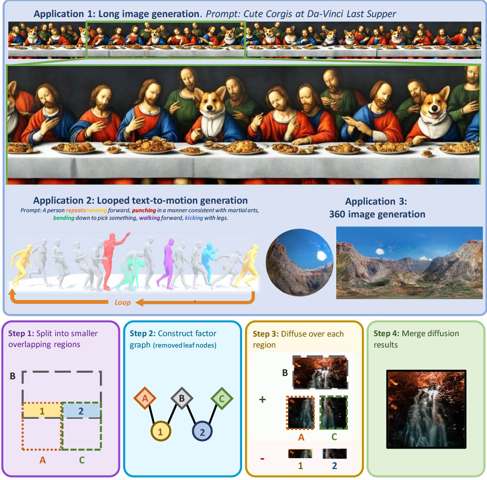

# <p align="center">DiffCollage: Parallel Generation of Large Content with Diffusion Models</p>

<div align="center">
  <!-- Authors -->
  <a href="https://qsh-zh.github.io/" target="_blank">
    Qinsheng Zhang
    <span style="color: #B31B1B;">&nbsp;<sup>1</sup></span>
    <span style="color: #76b900;">&nbsp;<sup>2</sup></span>
  </a>
  &emsp;
  <b>&middot;</b>
  &emsp;
  <a href="https://tsong.me/" target="_blank">
    Jiaming Song
    <span style="color: #76b900;">&nbsp;<sup>2</sup></span>
  </a>
  &emsp;
  <b>&middot;</b>
  &emsp;
  <a href="https://xunhuang.me/" target="_blank">
    Xun Huang
    <span style="color: #76b900;">&nbsp;<sup>2</sup></span>
  </a>
  &emsp;
  <b>&middot;</b>
  &emsp;
  <a href="https://yongxin.ae.gatech.edu/" target="_blank">
    Yongxin Chen
    <span style="color: #B31B1B;">&nbsp;<sup>1</sup></span>
  </a>
  &emsp;
  <b>&middot;</b>
  &emsp;
  <a href="http://mingyuliu.net/" target="_blank">
    Ming-Yu Liu
    <span style="color: #76b900;">&nbsp;<sup>2</sup></span>
  </a>

  <br>
    <div>
    <a href="http://www.gatech.edu/" target="_blank" style="display: inline; color: #B31B1B;">1. Georgia Institute of Technology</a>
    &emsp;
    <b>&middot;</b>
    &emsp;
    <a href="https://www.nvidia.com/" target="_blank" style="display: inline; margin-left: 10px; color: #76b900;">2. NVIDIA Corporation</a>
    </div>

  <!-- Paper Link -->
  <a href="https://arxiv.org/abs/2206.05564" target="_blank">Paper</a>
  &emsp;
  <b>&middot;</b>
  &emsp;
  <a href="https://research.nvidia.com/labs/dir/diffcollage/" target="_blank">Project page</a>
</div>


<br><br>

**TLDR**: DiffCollage, a scalable probabilistic model that synthesizes large content in parallel, including long images, looped motions, and 360 images, with diffusion models only trained on pieces of the content. 


 

# Diff Collage

Diffusion models and notations in this code base follows [EDM](https://arxiv.org/abs/2206.00364). 

* $\sigma = t$
* Diffusion forward process follows $x_\sigma = x_0 + \sigma \epsilon$
* Diffusion training objective $|x_0 - x_\theta(x_0 + \sigma \epsilon, \sigma)|^2$ (data prediction model) or $|\epsilon - \epsilon_\theta(x_0 + \sigma \epsilon, \sigma)|^2$ (noise prediction model)
* Conversion between data prediction model and noise prediction model: $\epsilon_\theta(x_\sigma, \sigma) = \frac{x_\sigma - x_\theta(x_0 + \sigma \epsilon, \sigma)}{\sigma} $


## Caveats

Please be aware of the following points when using this software:

1. **Model Conversion**:
   - If your model has been trained using methods other than [EDM](https://github.com/NVlabs/edm), you may need to convert it to EDM using the [change-of-variable](https://github.com/crowsonkb/k-diffusion/blob/master/k_diffusion/external.py#L116) method.

2. **Sampling hyperparameters**
    - We find stochastic sampling algorithms performance way more better than deterministic sampling algorithm when sampling step is high.

## usage

```python

import diff_collage as dc

def test(eps_fn, s_churn=10.0):
    n_step = 40 # sampling step
    overlap_size = 32 # how much overlap
    num_img = 11 # how many square images
    batch_size = 5
    ts_order = 5 # sampling timestamp schedule
    img_shape = (3, 64, 64) # image shape

    # sampling with conditional independence assumption
    worker = dc.condind_long.CondIndLong(img_shape, eps_fn, num_img, overlap_size=overlap_size)
    sample = dc.sampling(
        x = worker.generate_xT(batch_size),
        noise_fn = worker.noise,
        rev_ts = worker.rev_ts(n_step, ts_order),
        x0_pred_fn = worker.x0_fn,
        s_churn = s_churn,
        is_traj = False # return sampling traj or not
    )

    # sampling with average noise method
    worker = dc.AvgLong(img_shape, eps_fn, num_img, overlap_size=overlap_size)
    sample = dc.sampling(
        x = worker.generate_xT(batch_size),
        noise_fn = worker.noise,
        rev_ts = worker.rev_ts(n_step, ts_order),
        x0_pred_fn = worker.x0_fn,
        s_churn = s_churn,
        is_traj = False # return sampling traj or not
    )
```

# Application : text-to-motion generation

**The repo provides demo code for looped motion generation based on [Human Motion Diffusion Model](https://guytevet.github.io/mdm-page/) pretrained models**

<div class="grid-container-video" style="width: 90%; margin-left: auto; margin-right: auto">
    <div class="embed-responsive embed-responsive-16by9" style="margin: 0;">
        <video id="v1" width="100%" autoplay loop muted controls playbackRate="2.0">
            <source src="assets/looped_motion.mp4"type="video/mp4"/>
        </video>
    </div>
</div>

## seutp environment

```shell
sudo apt update
sudo apt install ffmpeg

conda env create -f environment.yml
conda activate mdm
python -m spacy download en_core_web_sm
pip install git+https://github.com/openai/CLIP.git

bash prepare/download_smpl_files.sh
bash prepare/download_glove.sh
```

## download checkpoint

```shell
cd save
gdown "https://drive.google.com/u/0/uc?id=1PE0PK8e5a5j-7-Xhs5YET5U5pGh0c821&export=download&confirm=t"
unzip humanml_trans_enc_512.zip
cd ..

# sanity check
python -m sample --model_path ./save/humanml_trans_enc_512/model000200000.pt --text_prompt "the person walked forward and is picking up his toolbox."
```


# Reference

```tex
@inproceedings{zhange2023diffcollage,
    title={DiffCollage: Parallel Generation of Large Content with Diffusion Models},
    author={Qinsheng Zhang and Jiaming Song and Xun Huang and Yongxin Chen and Ming-yu Liu},
    booktitle={CVPR},
    year={2023}
}
```